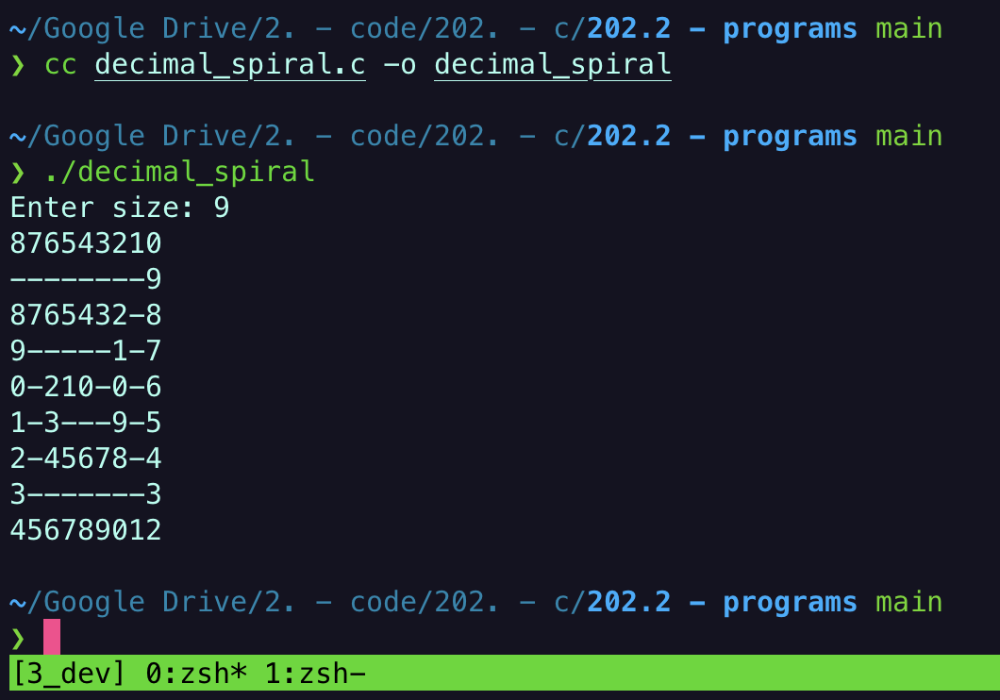

# Raison d'être

- here are some small and simple C programs that I made whilst first learning to program
- these could be of use to someone that either wants to check another implementation of the same trivial program, or for someone that simply wants the program itself.

# How to use

- the binary files are not attached as they are compiled only for my M1 ARM architecture
- you can however use `gcc` / `clang` / `cc` to manually compile these binaries
	- for a novice, I recommend `cc` as that will default to the system C compiler
- here is a screenshot of the process:

# Descriptions

## Baseconversion

- takes in number and base as arguments from stdin and converts number to the provided base

## Boxes

- displays a box with the width provided as an argument

## Caesar

- obscures text with the [caesar cipher](https://en.wikipedia.org/wiki/Caesar_cipher)

## Calculator

- a calculator that computes basic integer addition / subtraction

## Count up down

- counts up to a number then counts back down

## Decimal Spiral

- creates an ascii box spiral up to the number provided. see above.
- this was a difficult program to implement at the time of writing it. you need to approach this problem algorithmically and derive a quadratic which defines the relationship between the corner numbers.

## Devowel

- remove vowels from a given string

## Dinoshade

- a miscellaneous program not by me that has ended up here. this is what real C looks like.

## Donut

- also not by me, but I very cool program I recommend compiling and running (take a look at the source code first!).
- brought to my attention by Lex Friedman

## Easter

- finds the date of Easter on a particular year. a script that can fit very nicely within [alfred](https://github.com/br1ttle/alfred-workflows)

## Hello World!

- `printf("Hello World!\n");`

## Increments

- pre-increment vs. post-increment

## Is leap year (s)

- checks if a particular year is a leap year. also great for [alfred integration](https://github.com/br1ttle/alfred-workflows)

## Linked list

- basic operations on a singly-linked list:
	- print list
	- sum list
	- find item
	- find last
	- find nth
	- add item to end
	- remove first
	- remove last
	- remove item

## Perfect

- checks whether a given number is a [perfect number](https://en.wikipedia.org/wiki/Perfect_number)

## Postfix calculator

- implements a stack to calculate postfix operations on integers
	- i.e. `4 5 + 7 2 - *`

## Prime

- checks if a given number is prime. done iteratively.

## Quadratic

- got tired of factorising quadratics whilst teaching math. this is also integrated within alfred.

## Remove duplicates

- removes duplicates in 2 arrays

## Reverse array

- reverses an array in place

## Sandbox

- a playground. I am not liable for what you find in here

## Sawtooth

- an ascii program which prints a sawtooth

## Spiral

- another ascii program which prints a spiral to stdout

## Square Nums

- checks how many square numbers within a provided integer

## Turing Paint

- a one-dimensional array acts as a canvas
- on this canvas you can paint a colour (represented by an integer) from a particular position (another integer) a given number of times
- i.e. given an array of length 5, if we paint from position 1 to 3 colour 9 the array will look like [0, 9, 9, 9, 0].
- then we can paint ontop of this array starting at position 0 in colour 8 for 2 squares.
	- the resulting array will then be [8, 8, 9, 9, 0]
		- the program returns this array

## Uppercase

- changes a string to uppercase

## Vector Sum

- sums 2 given vectors

## Word Square

- prints out the string given to the program $x$ number of times, where $x$ is the number of characters in the string

## X

- ascii program which draws an `X` given some dimensions

